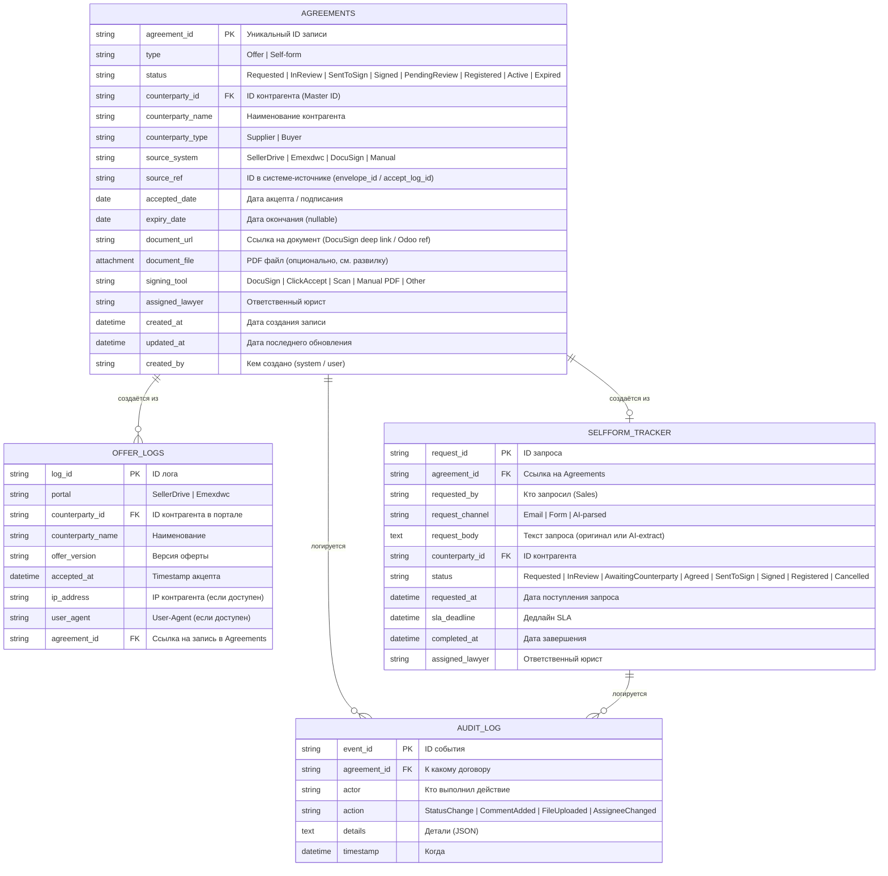
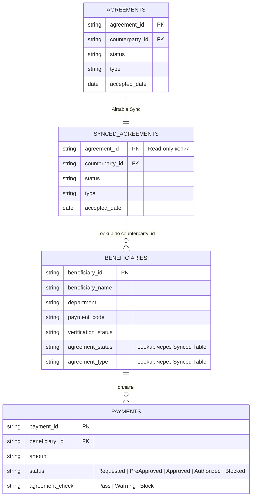
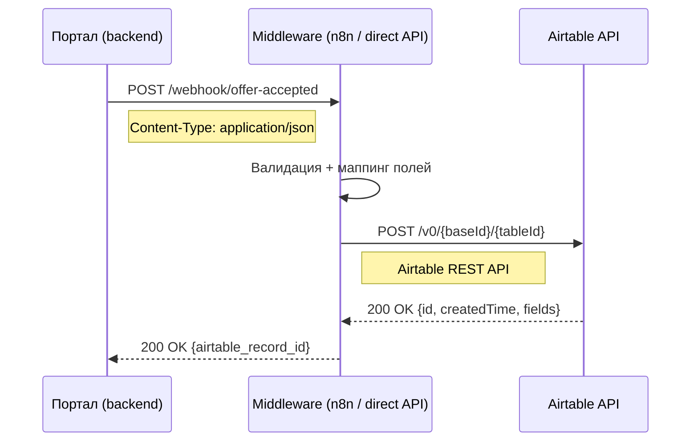
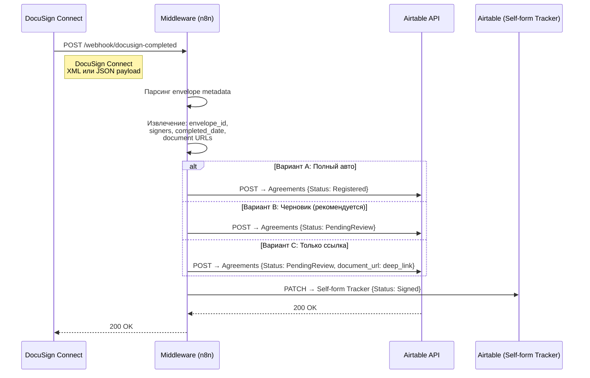
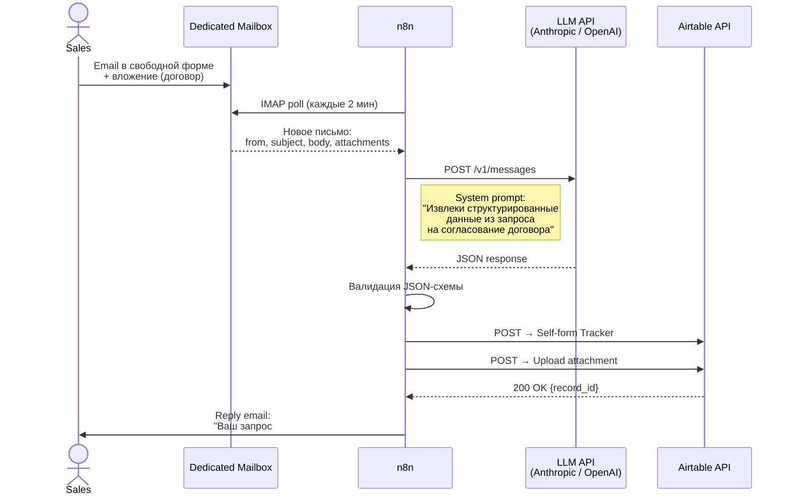
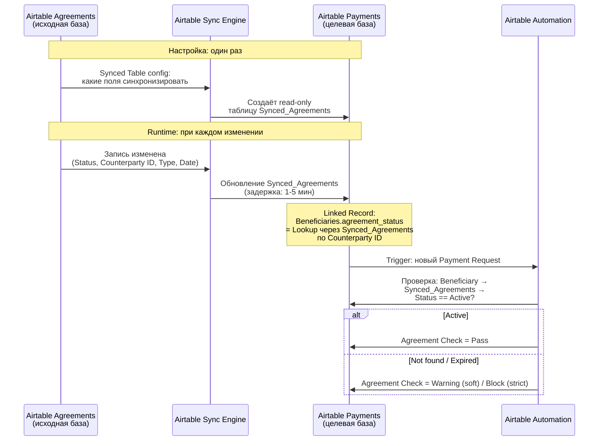
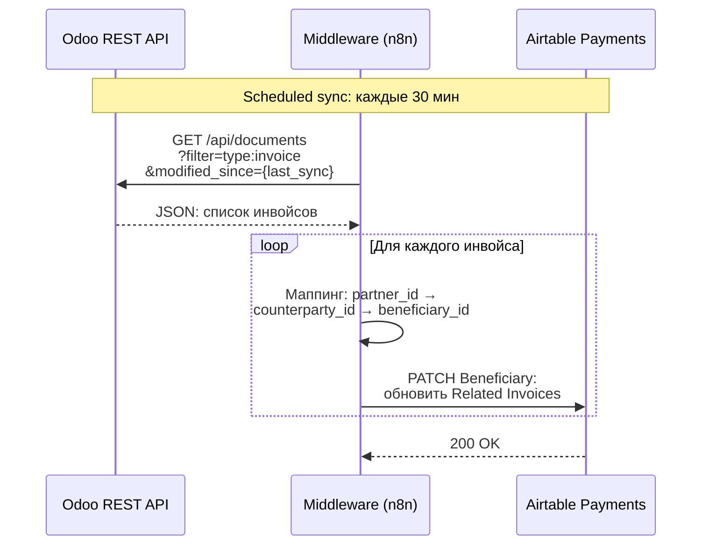

# Модель данных и схемы обмена

## 1. Обоснование подхода к документированию

### Выбор Mermaid + GitHub Markdown

Для визуализации процессов и архитектуры в проекте принят подход **Mermaid-as-Code в .md файлах**, размещённых в GitHub-репозитории.

**Аргументация:**

- **Нативный рендеринг в GitHub** — диаграммы отображаются визуально прямо в README, Issues, PR-описаниях без дополнительных инструментов и экспорта
- **Версионируемость** — диаграммы хранятся как код, изменения отслеживаются через git diff, доступна история правок
- **Скорость подготовки** — текстовое описание диаграммы быстрее создаётся и редактируется, чем работа в визуальном редакторе (draw.io, Figma)
- **Совместная работа** — любой участник команды может предложить изменение через PR без специализированного инструмента
- **Воспроизводимость** — диаграмма генерируется из исходника детерминированно, нет проблемы «у меня другая версия файла»
- **CI/CD-совместимость** — при необходимости Mermaid-код можно рендерить в PNG/SVG через CLI (mermaid-cli) для включения в PDF/PPT

**Типы диаграмм в проекте:**

| Тип | Нотация | Что показывает |
|-----|---------|----------------|
| Sequence Diagram | UML | Взаимодействие между акторами и системами, временная последовательность |
| State Diagram | UML | Жизненный цикл сущности (договор), состояния и переходы |
| ER Diagram | Mermaid erDiagram | Модель данных, связи между таблицами |
| Flowchart | Mermaid graph | Архитектура систем, потоки данных |

**Ограничения подхода:**

- Mermaid не поддерживает BPMN 2.0 нативно — при необходимости формальной BPMN-нотации используется draw.io с экспортом в SVG
- Сложные диаграммы с длинной кириллицей могут некорректно рендериться на GitHub — решается сокращением подписей
- Нет интерактивности в GitHub-рендеринге — для интерактивных артефактов используется GitHub Pages + HTML

---

## 2. Модель данных Airtable Agreements (целевая)

### ER-диаграмма



### Связь с Airtable Payments (Synced Table)



---

## 3. Схемы обмена данными

### 3.1 Портал → Airtable: событие акцепта оферты



**Payload: Портал → Middleware (сериализация)**

```json
{
  "event": "offer_accepted",
  "portal": "SellerDrive",
  "timestamp": "2026-03-12T14:30:00Z",
  "data": {
    "counterparty_id": "SD-SUP-001234",
    "counterparty_name": "Acme Trading LLC",
    "counterparty_type": "supplier",
    "offer_version": "v3.2-2026",
    "ip_address": "185.123.45.67",
    "user_agent": "Mozilla/5.0 ..."
  }
}
```

**Маппинг: Middleware → Airtable (десериализация + трансформация)**

```json
{
  "fields": {
    "Type": "Offer",
    "Status": "Active",
    "Counterparty ID": "SD-SUP-001234",
    "Counterparty Name": "Acme Trading LLC",
    "Counterparty Type": "Supplier",
    "Source System": "SellerDrive",
    "Source Ref": "SD-SUP-001234:v3.2-2026:2026-03-12T14:30:00Z",
    "Accepted Date": "2026-03-12",
    "Signing Tool": "ClickAccept",
    "Created By": "system:portal-sync"
  }
}
```

**Обработка ошибок:**

| Код | Ситуация | Действие middleware |
|-----|----------|---------------------|
| 200 | Успех | Сохраняет airtable_record_id, возвращает 200 порталу |
| 422 | Дублирующая запись (уже есть запись с таким Source Ref) | Пропускает, возвращает 200 + `"status": "duplicate_skipped"` |
| 429 | Rate limit Airtable (5 req/sec) | Retry с exponential backoff (1s, 2s, 4s), макс. 3 попытки |
| 500 | Ошибка Airtable | Запись в error-очередь (dead letter queue), alert, retry через 5 мин |

---

### 3.2 DocuSign → Airtable: подписанный документ



**Payload: DocuSign Connect → Middleware (входящий)**

```json
{
  "event": "envelope-completed",
  "apiVersion": "v2.1",
  "uri": "/envelopes/a1b2c3d4-...",
  "data": {
    "envelopeId": "a1b2c3d4-e5f6-7890-abcd-ef1234567890",
    "status": "completed",
    "completedDateTime": "2026-03-12T16:45:00Z",
    "emailSubject": "3PL SERVICE AGREEMENT - Acme Trading",
    "sender": {
      "email": "lawyer@company.com",
      "name": "Ivan Petrov"
    },
    "recipients": {
      "signers": [
        {
          "email": "contact@acme-trading.com",
          "name": "John Smith",
          "status": "completed",
          "signedDateTime": "2026-03-12T16:45:00Z"
        }
      ]
    },
    "envelopeDocuments": [
      {
        "documentId": "1",
        "name": "3PL_Service_Agreement.pdf",
        "uri": "/envelopes/a1b2c3d4-.../documents/1"
      }
    ],
    "customFields": {
      "textCustomFields": [
        {"name": "counterparty_id", "value": "SD-SUP-001234"},
        {"name": "agreement_type", "value": "3PL Service Agreement"}
      ]
    }
  }
}
```

**Маппинг: Middleware → Airtable Agreements**

```json
{
  "fields": {
    "Type": "Self-form",
    "Status": "PendingReview",
    "Counterparty ID": "SD-SUP-001234",
    "Counterparty Name": "John Smith (Acme Trading)",
    "Source System": "DocuSign",
    "Source Ref": "a1b2c3d4-e5f6-7890-abcd-ef1234567890",
    "Accepted Date": "2026-03-12",
    "Document URL": "https://app.docusign.com/documents/details/a1b2c3d4-...",
    "Signing Tool": "DocuSign",
    "Assigned Lawyer": "Ivan Petrov",
    "Created By": "system:docusign-webhook"
  }
}
```

**Важные решения при маппинге:**

| Вопрос | Решение | Обоснование |
|--------|---------|-------------|
| Как извлечь counterparty_id? | Из DocuSign Custom Fields (настраивается при отправке конверта) | Надёжнее, чем парсинг email subject |
| Хранить PDF или ссылку? | Развилка — см. раздел 4 (TO-BE) | Ссылка экономит место, PDF — автономность |
| Как связать с Self-form Tracker? | По envelope_id: при отправке в DocuSign middleware записывает envelope_id в Tracker | Позволяет обновить статус при получении webhook |

---

### 3.3 Sales email → AI-парсинг → Airtable



**Prompt → LLM (системный)**

```
Ты — ассистент бизнес-аналитика. Из текста email извлеки структурированные данные 
о запросе на согласование договора. Верни ТОЛЬКО JSON, без пояснений.

Схема ответа:
{
  "counterparty_name": "string — наименование контрагента",
  "counterparty_type": "supplier | buyer | unknown",
  "agreement_type": "string — тип договора (supply, service, 3PL, NDA, other)",
  "urgency": "normal | urgent",
  "summary": "string — краткое описание запроса (1-2 предложения)",
  "has_attachment": true/false,
  "confidence": 0.0-1.0
}

Если не удаётся определить поле — ставь null. 
Если confidence < 0.7, добавь "needs_review": true.
```

**Payload: LLM → n8n (десериализация)**

```json
{
  "counterparty_name": "Acme Trading LLC",
  "counterparty_type": "supplier",
  "agreement_type": "3PL Service Agreement",
  "urgency": "normal",
  "summary": "Поставщик Acme Trading просит согласовать договор 3PL на обслуживание склада в Дубае",
  "has_attachment": true,
  "confidence": 0.92,
  "needs_review": false
}
```

**Маппинг: n8n → Airtable Self-form Tracker**

```json
{
  "fields": {
    "Request Channel": "Email (AI-parsed)",
    "Counterparty Name": "Acme Trading LLC",
    "Counterparty Type": "Supplier",
    "Status": "Requested",
    "Request Body": "Поставщик Acme Trading просит согласовать договор 3PL на обслуживание склада в Дубае",
    "Requested By": "sales-manager@company.com",
    "Requested At": "2026-03-12T10:15:00Z",
    "SLA Deadline": "2026-03-19T10:15:00Z",
    "AI Confidence": 0.92,
    "Original Email Subject": "FW: Agreement for warehouse - Acme Trading",
    "Created By": "system:email-ai-parser"
  }
}
```

**Обработка edge cases:**

| Ситуация | Действие |
|----------|----------|
| confidence < 0.7 | Создать запись со статусом "NeedsManualReview", уведомить Legal |
| Нет вложения, но текст указывает на договор | Создать запись, в комментарии: "Вложение не обнаружено — уточнить у Sales" |
| Email не про договор (ошибочно отправлен) | LLM возвращает `"agreement_type": null, "confidence": 0.1` → не создавать запись, переслать обратно отправителю |
| Дублирующий запрос (тот же контрагент + тема) | n8n проверяет дубликаты по Counterparty Name + 24h window → предупреждение |

---

### 3.4 Airtable Agreements → Airtable Payments (Synced Table)



**Синхронизируемые поля (SRC → DST, read-only):**

| Поле в Agreements | Поле в Synced Table | Зачем |
|-------------------|---------------------|-------|
| agreement_id | agreement_id | PK для связи |
| counterparty_id | counterparty_id | Ключ маппинга с Beneficiary |
| counterparty_name | counterparty_name | Для отображения |
| type | type | Offer / Self-form |
| status | status | Для Agreement Check |
| accepted_date | accepted_date | Для отображения |
| expiry_date | expiry_date | Для проверки актуальности |

**Не синхронизируются (остаются только в Agreements):** document_file, document_url, assigned_lawyer, audit_log, request_body — это данные Legal, Finance не нужны.

---

### 3.5 Odoo Documents ↔ Airtable (инвойсы, Phase 3)



**Payload: Odoo → Middleware**

```json
{
  "documents": [
    {
      "id": 4521,
      "name": "INV-2026-0312",
      "type": "invoice",
      "direction": "outgoing",
      "partner_id": 1234,
      "partner_name": "Acme Trading LLC",
      "amount": 15000.00,
      "currency": "USD",
      "date": "2026-03-10",
      "state": "posted",
      "attachment_url": "/web/content/4521"
    }
  ]
}
```

**Ключевая проблема: маппинг ID**

Odoo использует `partner_id`, порталы — свои ID, Airtable — свои record ID. Необходима таблица маппинга:

```json
{
  "master_id": "CPTY-001234",
  "odoo_partner_id": 1234,
  "sellerdrive_id": "SD-SUP-001234",
  "emexdwc_id": null,
  "airtable_agreements_record": "rec1a2b3c4d",
  "airtable_payments_beneficiary": "rec5e6f7g8h"
}
```

Эта таблица может храниться как отдельная таблица в Airtable (Master Counterparty Registry) или в n8n как lookup dataset.
