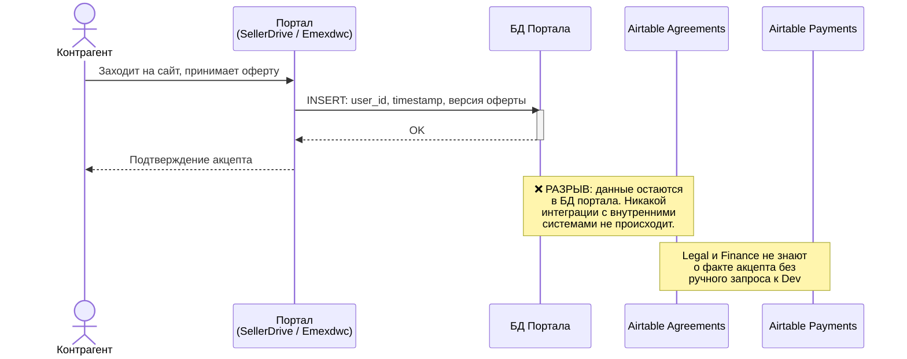
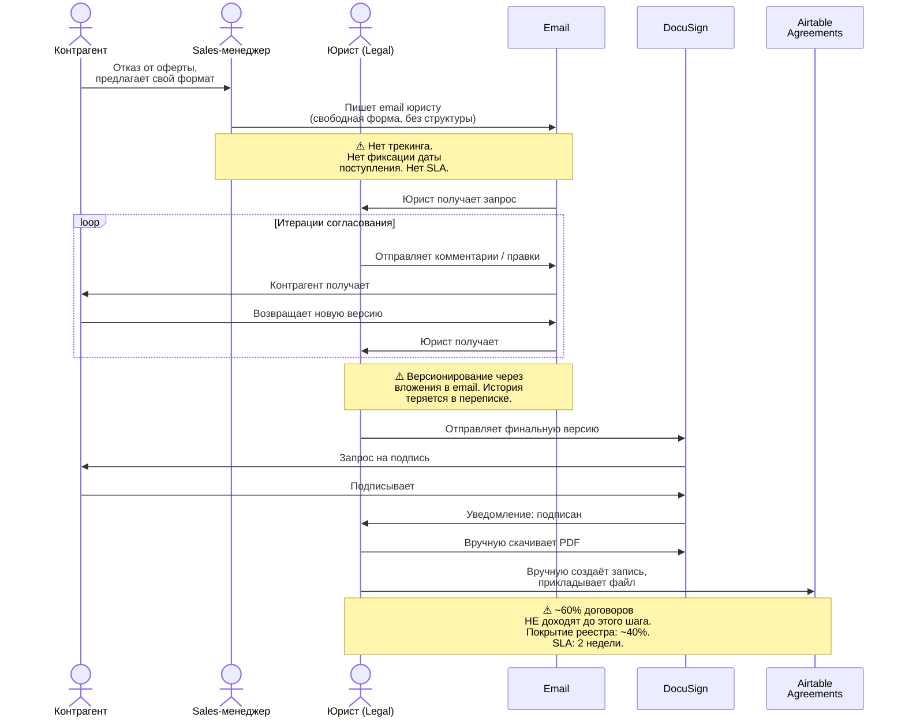
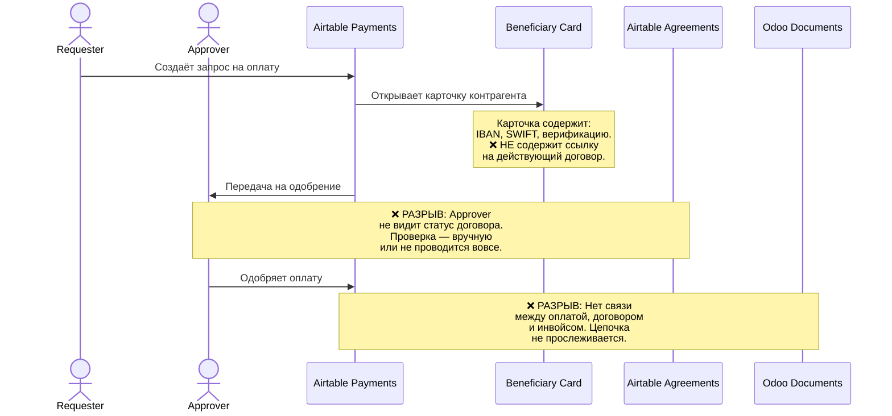

# AS-IS: Sequence Diagrams

## Поток 1 — Акцепт публичной оферты

```mermaid
sequenceDiagram
    actor C as Контрагент
    participant P as Портал<br/>(SellerDrive / Emexdwc)
    participant DB as БД Портала
    participant AT as Airtable Agreements
    participant PAY as Airtable Payments

    C->>P: Заходит на сайт, принимает оферту
    P->>DB: INSERT: user_id, timestamp, версия оферты
    activate DB
    DB-->>P: OK
    deactivate DB
    P-->>C: Подтверждение акцепта

    Note over DB,AT: ❌ РАЗРЫВ: данные остаются<br/>в БД портала. Никакой<br/>интеграции с внутренними<br/>системами не происходит.

    Note over AT,PAY: Legal и Finance не знают<br/>о факте акцепта без<br/>ручного запроса к Dev
```

## Поток 2 — Self-form Agreement (индивидуальный договор)

```mermaid
sequenceDiagram
    actor C as Контрагент
    actor S as Sales-менеджер
    actor L as Юрист (Legal)
    participant EM as Email
    participant DS as DocuSign
    participant AT as Airtable<br/>Agreements

    C->>S: Отказ от оферты,<br/>предлагает свой формат
    S->>EM: Пишет email юристу<br/>(свободная форма, без структуры)

    Note over S,EM: ⚠️ Нет трекинга.<br/>Нет фиксации даты<br/>поступления. Нет SLA.

    EM->>L: Юрист получает запрос
    
    loop Итерации согласования
        L->>EM: Отправляет комментарии / правки
        EM->>C: Контрагент получает
        C->>EM: Возвращает новую версию
        EM->>L: Юрист получает
    end

    Note over L,EM: ⚠️ Версионирование через<br/>вложения в email. История<br/>теряется в переписке.

    L->>DS: Отправляет финальную версию
    DS->>C: Запрос на подпись
    C->>DS: Подписывает
    DS->>L: Уведомление: подписан

    L->>DS: Вручную скачивает PDF
    L->>AT: Вручную создаёт запись,<br/>прикладывает файл

    Note over L,AT: ⚠️ ~60% договоров<br/>НЕ доходят до этого шага.<br/>Покрытие реестра: ~40%.<br/>SLA: 2 недели.
```

## Поток 3 — Оплата (параллельный, без связи с договорами)

```mermaid
sequenceDiagram
    actor REQ as Requester
    actor APP as Approver
    participant PAY as Airtable Payments
    participant BEN as Beneficiary Card
    participant AT as Airtable Agreements
    participant ODOO as Odoo Documents

    REQ->>PAY: Создаёт запрос на оплату
    PAY->>BEN: Открывает карточку контрагента

    Note over BEN: Карточка содержит:<br/>IBAN, SWIFT, верификацию.<br/>❌ НЕ содержит ссылку<br/>на действующий договор.

    PAY->>APP: Передача на одобрение
    
    Note over APP,AT: ❌ РАЗРЫВ: Approver<br/>не видит статус договора.<br/>Проверка — вручную<br/>или не проводится вовсе.

    APP->>PAY: Одобряет оплату

    Note over PAY,ODOO: ❌ РАЗРЫВ: Нет связи<br/>между оплатой, договором<br/>и инвойсом. Цепочка<br/>не прослеживается.
```
