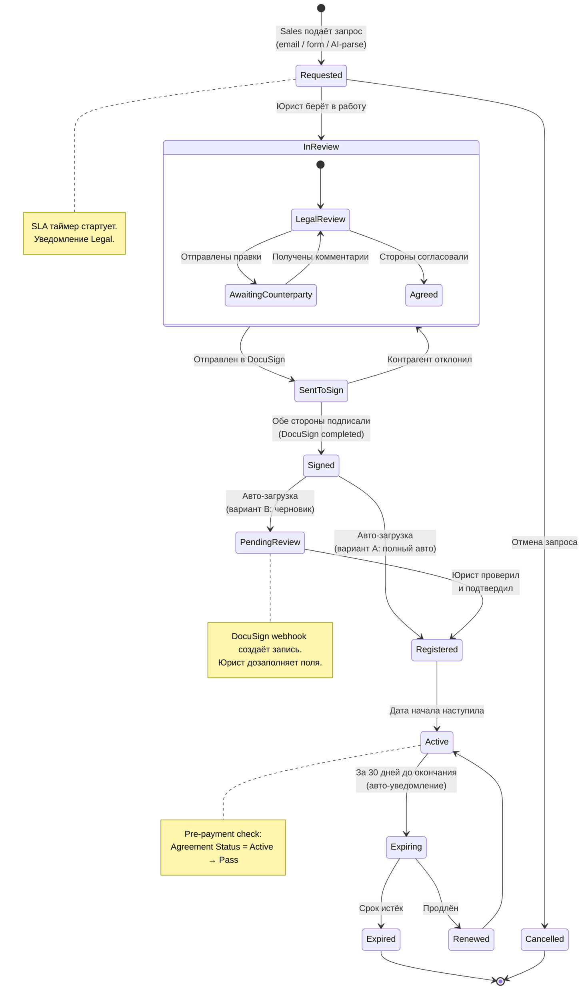
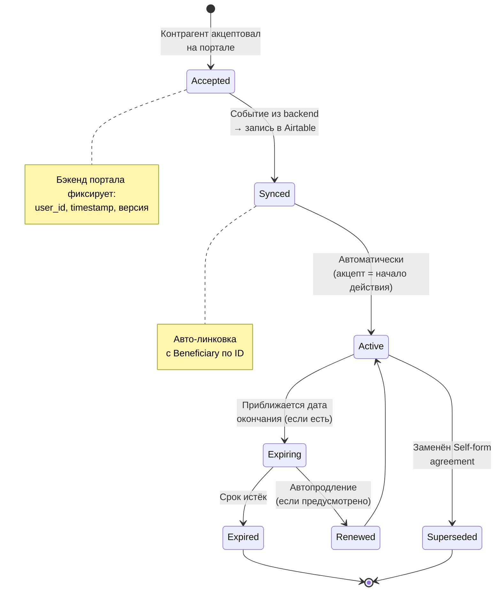
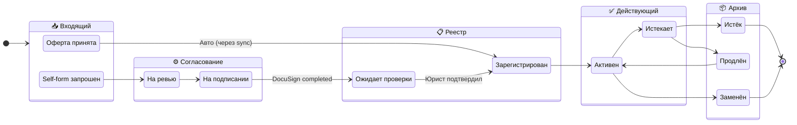

# Жизненный цикл договора — State Diagram

## Self-form Agreement (индивидуальный договор)

```mermaid
stateDiagram-v2
    [*] --> Requested: Sales подаёт запрос<br/>(email / form / AI-parse)

    Requested --> InReview: Юрист берёт в работу
    Requested --> Cancelled: Отмена запроса

    state InReview {
        [*] --> LegalReview
        LegalReview --> AwaitingCounterparty: Отправлены правки
        AwaitingCounterparty --> LegalReview: Получены комментарии
        LegalReview --> Agreed: Стороны согласовали
    }

    InReview --> SentToSign: Отправлен в DocuSign

    SentToSign --> Signed: Обе стороны подписали<br/>(DocuSign completed)
    SentToSign --> InReview: Контрагент отклонил

    Signed --> PendingReview: Авто-загрузка<br/>(вариант B: черновик)
    Signed --> Registered: Авто-загрузка<br/>(вариант A: полный авто)

    PendingReview --> Registered: Юрист проверил<br/>и подтвердил

    Registered --> Active: Дата начала наступила
    Active --> Expiring: За 30 дней до окончания<br/>(авто-уведомление)
    Expiring --> Renewed: Продлён
    Expiring --> Expired: Срок истёк

    Renewed --> Active
    Expired --> [*]
    Cancelled --> [*]

    note right of Requested
        SLA таймер стартует.
        Уведомление Legal.
    end note

    note right of PendingReview
        DocuSign webhook создаёт запись.
        Юрист дозаполняет поля.
    end note

    note right of Active
        Pre-payment check:
        Agreement Status = Active → Pass
    end note
```

## Публичная оферта (Offer)

```mermaid
stateDiagram-v2
    [*] --> Accepted: Контрагент акцептовал<br/>на портале

    Accepted --> Synced: Событие из backend<br/>→ запись в Airtable

    Synced --> Active: Автоматически<br/>(акцепт = начало действия)

    Active --> Expiring: Приближается дата<br/>окончания (если есть)
    Active --> Superseded: Заменён Self-form<br/>agreement
    
    Expiring --> Renewed: Автопродление<br/>(если предусмотрено)
    Expiring --> Expired: Срок истёк
    Renewed --> Active
    
    Expired --> [*]
    Superseded --> [*]

    note right of Accepted
        Бэкенд портала фиксирует:
        user_id, timestamp, версия
    end note

    note right of Synced
        Авто-линковка
        с Beneficiary по ID
    end note
```

## Общий жизненный цикл — упрощённый вид

```mermaid
stateDiagram-v2
    direction LR

    state "📥 Входящий" as input {
        Offer_Accepted: Оферта принята
        SF_Requested: Self-form запрошен
    }

    state "⚙️ Согласование" as process {
        In_Review: На ревью
        Sent_to_Sign: На подписании
    }

    state "📋 Реестр" as registry {
        Pending_Review: Ожидает проверки
        Registered: Зарегистрирован
    }

    state "✅ Действующий" as lifecycle {
        Active: Активен
        Expiring: Истекает
    }

    state "📦 Архив" as archive {
        Expired: Истёк
        Renewed: Продлён
        Superseded: Заменён
    }

    [*] --> input
    Offer_Accepted --> Registered: Авто (через sync)
    SF_Requested --> In_Review
    In_Review --> Sent_to_Sign
    Sent_to_Sign --> Pending_Review: DocuSign completed
    Pending_Review --> Registered: Юрист подтвердил
    Registered --> Active
    Active --> Expiring
    Expiring --> Renewed
    Expiring --> Expired
    Active --> Superseded
    Renewed --> Active
    Expired --> [*]
    Superseded --> [*]
```
