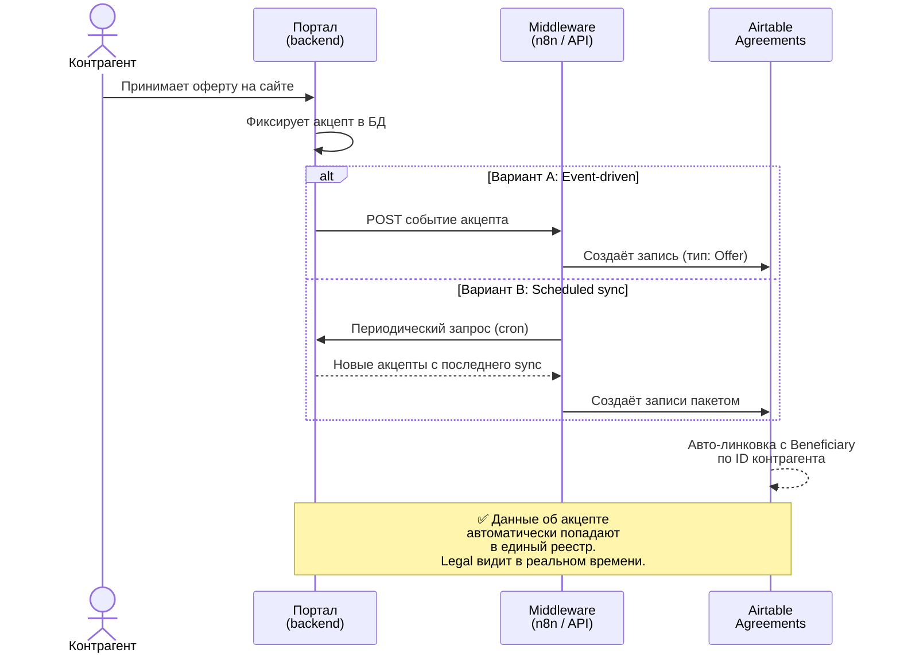
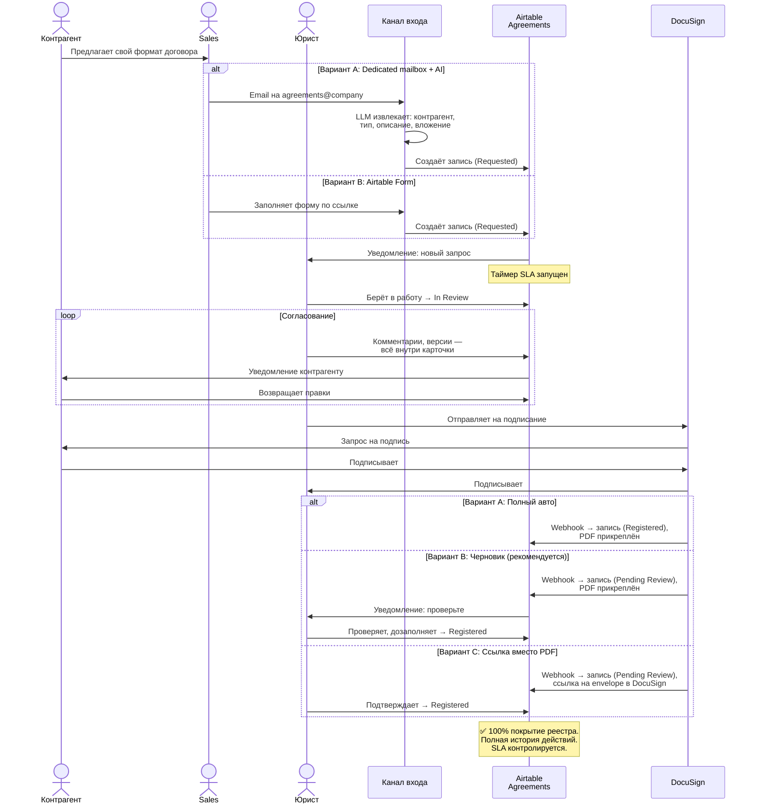
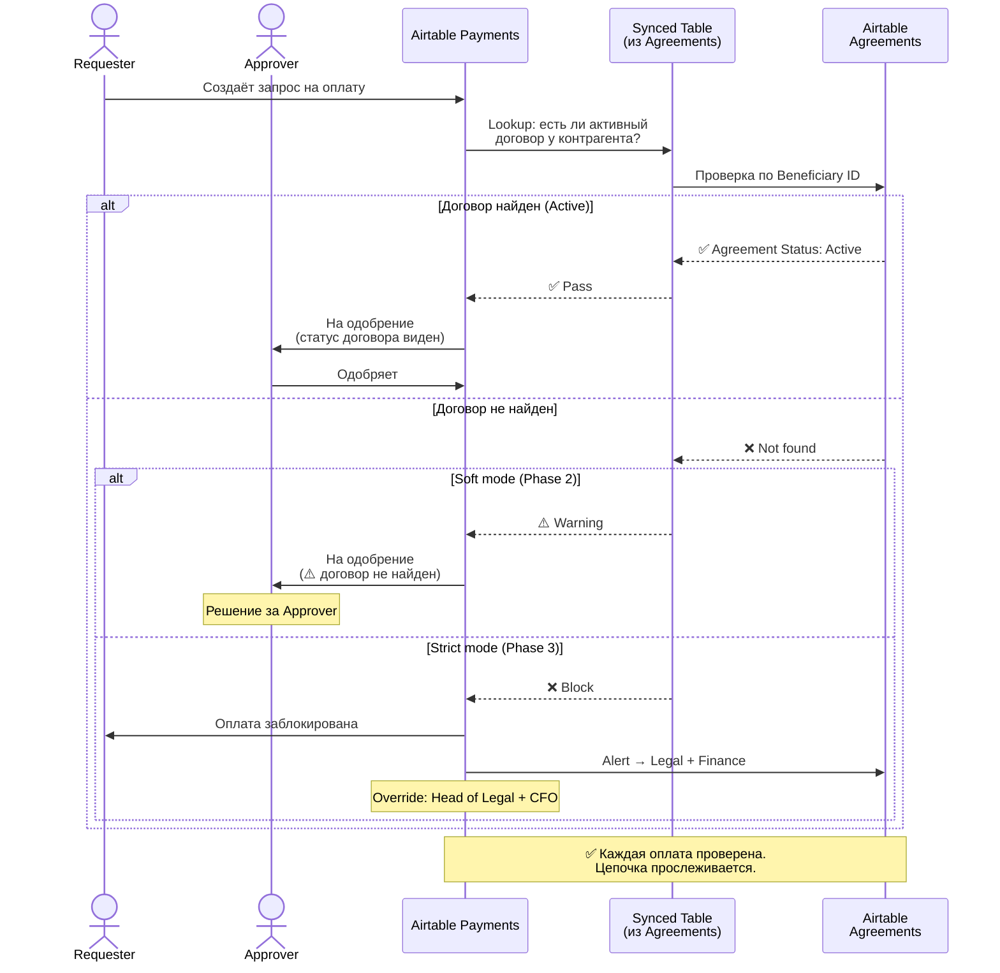

# TO-BE: Sequence Diagrams

## Поток 1 — Акцепт оферты (автоматический сбор)

```mermaid
sequenceDiagram
    actor C as Контрагент
    participant P as Портал<br/>(backend)
    participant MW as Middleware<br/>(n8n / API)
    participant AT as Airtable<br/>Agreements

    C->>P: Принимает оферту на сайте
    P->>P: Фиксирует акцепт в БД

    alt Вариант A: Event-driven
        P->>MW: POST событие акцепта
        MW->>AT: Создаёт запись (тип: Offer)
    else Вариант B: Scheduled sync
        MW->>P: Периодический запрос (cron)
        P-->>MW: Новые акцепты с последнего sync
        MW->>AT: Создаёт записи пакетом
    end

    AT-->>AT: Авто-линковка с Beneficiary<br/>по ID контрагента

    Note over P,AT: ✅ Данные об акцепте<br/>автоматически попадают<br/>в единый реестр.<br/>Legal видит в реальном времени.
```

## Поток 2 — Self-form Agreement (управляемый workflow)

```mermaid
sequenceDiagram
    actor C as Контрагент
    actor S as Sales
    actor L as Юрист
    participant IN as Канал входа
    participant AT as Airtable<br/>Agreements
    participant DS as DocuSign

    C->>S: Предлагает свой формат договора

    alt Вариант A: Dedicated mailbox + AI
        S->>IN: Email на agreements@company
        IN->>IN: LLM извлекает: контрагент,<br/>тип, описание, вложение
        IN->>AT: Создаёт запись (Requested)
    else Вариант B: Airtable Form
        S->>IN: Заполняет форму по ссылке
        IN->>AT: Создаёт запись (Requested)
    end

    AT->>L: Уведомление: новый запрос
    Note over AT: Таймер SLA запущен

    L->>AT: Берёт в работу → In Review
    
    loop Согласование
        L->>AT: Комментарии, версии —<br/>всё внутри карточки
        AT->>C: Уведомление контрагенту
        C->>AT: Возвращает правки
    end

    L->>DS: Отправляет на подписание
    DS->>C: Запрос на подпись
    C->>DS: Подписывает
    DS->>L: Подписывает

    alt Вариант A: Полный авто
        DS->>AT: Webhook → запись (Registered),<br/>PDF прикреплён
    else Вариант B: Черновик (рекомендуется)
        DS->>AT: Webhook → запись (Pending Review),<br/>PDF прикреплён
        AT->>L: Уведомление: проверьте
        L->>AT: Проверяет, дозаполняет → Registered
    else Вариант C: Ссылка вместо PDF
        DS->>AT: Webhook → запись (Pending Review),<br/>ссылка на envelope в DocuSign
        L->>AT: Подтверждает → Registered
    end

    Note over AT: ✅ 100% покрытие реестра.<br/>Полная история действий.<br/>SLA контролируется.
```

## Поток 3 — Оплата с Pre-payment Check

```mermaid
sequenceDiagram
    actor REQ as Requester
    actor APP as Approver
    participant PAY as Airtable Payments
    participant SYNC as Synced Table<br/>(из Agreements)
    participant AT as Airtable<br/>Agreements

    REQ->>PAY: Создаёт запрос на оплату

    PAY->>SYNC: Lookup: есть ли активный<br/>договор у контрагента?
    SYNC->>AT: Проверка по Beneficiary ID

    alt Договор найден (Active)
        AT-->>SYNC: ✅ Agreement Status: Active
        SYNC-->>PAY: ✅ Pass
        PAY->>APP: На одобрение<br/>(статус договора виден)
        APP->>PAY: Одобряет
    else Договор не найден
        AT-->>SYNC: ❌ Not found
        alt Soft mode (Phase 2)
            SYNC-->>PAY: ⚠️ Warning
            PAY->>APP: На одобрение<br/>(⚠️ договор не найден)
            Note over APP: Решение за Approver
        else Strict mode (Phase 3)
            SYNC-->>PAY: ❌ Block
            PAY->>REQ: Оплата заблокирована
            PAY->>AT: Alert → Legal + Finance
            Note over PAY: Override: Head of Legal + CFO
        end
    end

    Note over PAY,AT: ✅ Каждая оплата проверена.<br/>Цепочка прослеживается.
```
