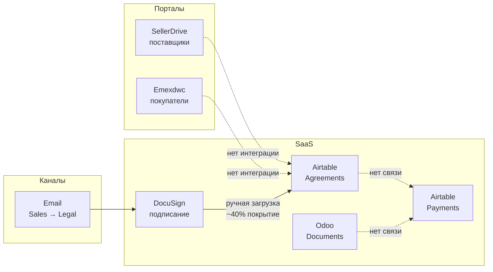
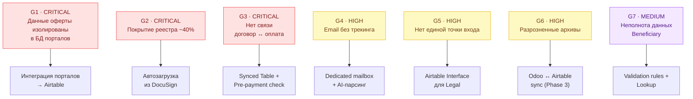
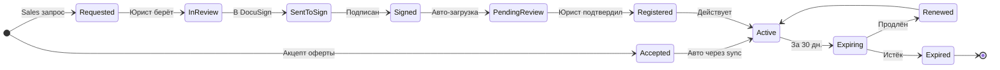
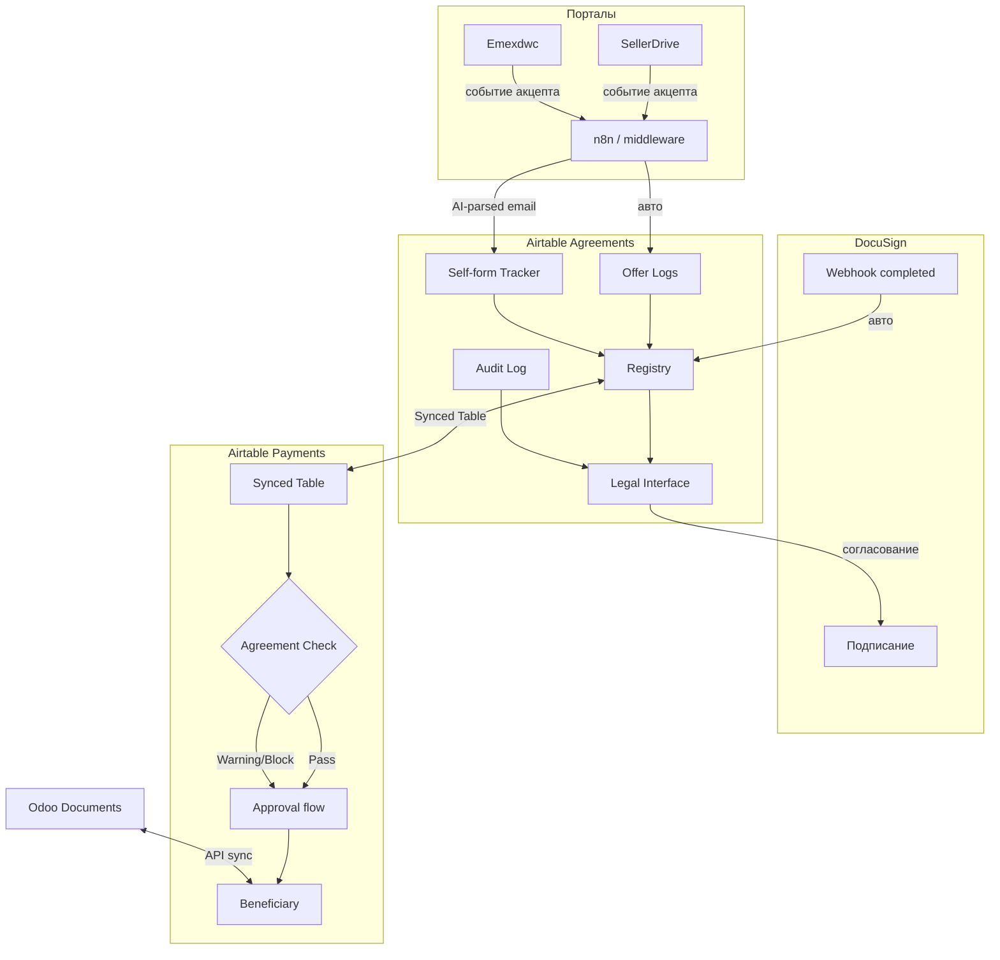
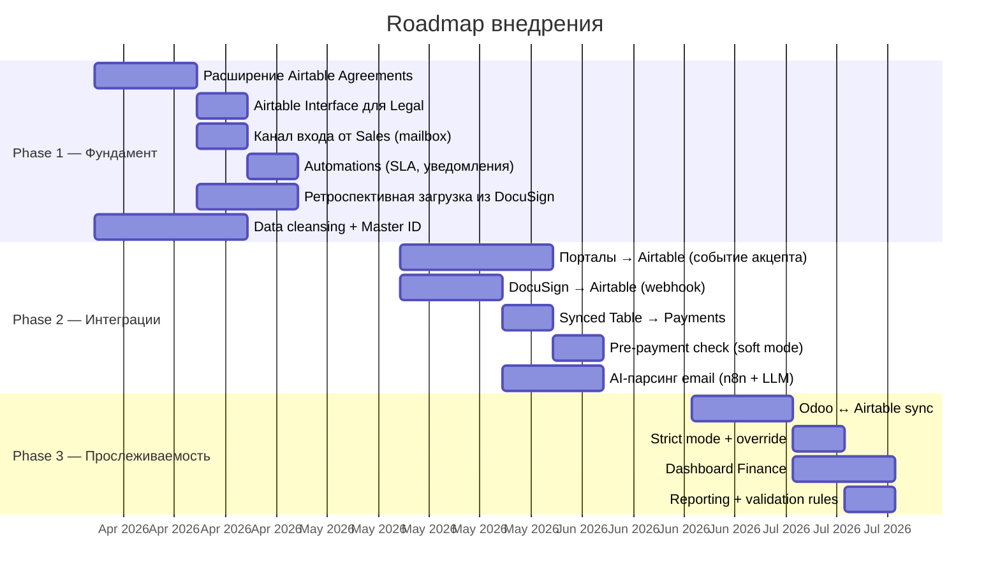

# Agreement Management Process Optimization

> Анализ и оптимизация процесса хранения, согласования и контроля договоров (User Agreements) с целью создания единого портала для Legal, обеспечения прослеживаемой цепочки «договор → инвойс → оплата» для Finance и сокращения SLA с 2 недель до 1 недели.

---

## Содержание

| Артефакт | Описание |
|----------|----------|
| 📄 **README.md** | Обзор проекта, ключевые диаграммы, навигация *(вы здесь)* |
| 📋 [requirements.md](requirements.md) | Реестр требований: функциональные, нефункциональные, ограничения, трассируемость |
| 🔍 [diagrams_as_is.md](diagrams_as_is.md) | AS-IS: Sequence Diagrams трёх потоков (оферта, Self-form, оплаты) |
| 🎯 [diagrams_to_be.md](diagrams_to_be.md) | TO-BE: Sequence Diagrams с развилками решений |
| 🔄 [diagrams_state.md](diagrams_state.md) | State Diagrams: жизненный цикл договора (Self-form + Offer) |
| 🗄️ [data_model_and_exchanges.md](data_model_and_exchanges.md) | Модель данных (ER), схемы обмена, JSON-контракты, обработка ошибок |
| 🌐 [Интерактивный отчёт](https://myazykov.github.io/Emex_Test/) | **[Открыть →](https://myazykov.github.io/Emex_Test/)** Контекст, AS-IS, GAP, TO-BE, риски, roadmap, вопросы |

---

## Контекст задачи

Компания работает с ~200 поставщиками и ~500 покупателями. Договорные отношения оформляются двумя способами: акцепт публичной оферты на сайте (SellerDrive / Emexdwc) и подписание индивидуального договора (Self-form agreement) через DocuSign. Параллельно Finance ведёт оплаты в Airtable Payments, а инвойсы архивируются в Odoo Documents.

**Заказчики:** Legal (основной) и Finance (со-заказчик).

**Проблема:** процесс рассредоточен по 6 системам без интеграций. Реестр договоров покрывает ~40% контрагентов. Нет связи между договорами и оплатами. Нет единой точки входа для юристов. SLA не контролируется.

---

## Ландшафт систем

---

## GAP-анализ (сводка)

---

## Ключевые развилки TO-BE

Поскольку интервью со стейкхолдерами не проводились, решение построено с вариативностью. Каждая развилка содержит 2–3 варианта с аргументацией «за / против». Подробности — в [diagrams_to_be.md](diagrams_to_be.md) и [docs/analysis.html](docs/analysis.html).

| # | Развилка | Варианты | Рекомендация |
|---|----------|----------|--------------|
| 1 | Передача данных об акцепте оферты с порталов | A: Event-driven (webhook) · B: Scheduled sync (cron) · C: iPaaS (n8n/Zapier) | A — realtime, минимальная доработка бэкенда |
| 2 | Канал входа запросов от Sales | A: Dedicated mailbox + AI-парсинг · B: Airtable Form · C: Email-шаблон + парсинг | A — Sales не меняют привычку, данные структурируются через LLM |
| 3 | Загрузка подписанного документа из DocuSign | A: Полный авто → Registered · B: Авто → PendingReview → Registered · C: Ручная + напоминания | B — автоматизация + контроль юриста |
| 4 | Связь договоров с оплатами | A: Synced Table + Lookup (без изменения Beneficiary) · B: Добавление полей в Beneficiary | A — минимальное вмешательство в структуру Payments |
| 5 | Pre-payment check режим | A: Soft mode (warning) · B: Strict mode (block) | A→B — начать с soft, перейти в strict при покрытии ≥95% |

---

## Жизненный цикл договора

---

## Целевая архитектура

---

## KPI: до и после

| Метрика | AS-IS | TO-BE |
|---------|-------|-------|
| Покрытие реестра | ~40% | 100% |
| SLA согласования | 14 дней | ≤ 7 дней |
| Время «подписание → реестр» | 1–5 дней | < 5 мин |
| Оплат с проверкой договора | 0% | 100% |
| Потерянных запросов от Sales | не измеряется | 0 |
| Систем для ежедневной работы Legal | 3+ | 1 (+ DocuSign для подписания) |

---

## Roadmap

---

## Навигация по артефактам

### Анализ

- [📋 Реестр требований](requirements.md) — FR/NFR/Constraints, статусы Confirmed/Derived/Open, трассируемость
- [🌐 Интерактивный отчёт](https://myazykov.github.io/Emex_Test/) — полный анализ с навигацией (GitHub Pages)

### Диаграммы

- [🔍 AS-IS Sequence Diagrams](diagrams_as_is.md) — три потока: оферта, Self-form, оплаты
- [🎯 TO-BE Sequence Diagrams](diagrams_to_be.md) — целевые потоки с alt-блоками по развилкам
- [🔄 State Diagrams](diagrams_state.md) — жизненный цикл Self-form + Offer + общий вид

### Проектирование

- [🗄️ Модель данных и обмены](data_model_and_exchanges.md) — ER-диаграмма, JSON-контракты 5 точек интеграции, обработка ошибок, маппинг ID

---

## Подход к документированию

Проект использует **Mermaid-as-Code** для всех диаграмм. Обоснование подхода, типы используемых диаграмм и ограничения описаны в [data_model_and_exchanges.md → раздел 1](data_model_and_exchanges.md#1-обоснование-подхода-к-документированию).

**Типы диаграмм:**

- **Sequence Diagram** (UML) — взаимодействие между акторами и системами, временная последовательность, точки разрыва
- **State Diagram** (UML) — жизненный цикл сущностей, состояния, переходы, бизнес-правила
- **ER Diagram** — модель данных, связи между таблицами, ключи
- **Flowchart** — архитектура систем, потоки данных
- **Gantt** — roadmap внедрения

---

## Открытые вопросы

Полный список из 23 вопросов с привязкой к развилкам — в [интерактивном отчёте, раздел «Вопросы»](https://myazykov.github.io/Emex_Test/) и в [requirements.md, раздел 5](requirements.md#5-нерешённые-требования-зависят-от-open-questions).

Ключевые вопросы, блокирующие финализацию:

| OQ | Вопрос | К кому | Что определяет |
|----|--------|--------|----------------|
| OQ-1 | Проверяет ли Legal документ перед добавлением в реестр? | Legal | Развилка 3 (авто vs черновик) |
| OQ-7 | Как сейчас проверяется наличие договора перед оплатой? | Finance | Baseline для pre-payment check |
| OQ-9 | Кто владелец структуры Airtable Payments? | Finance/IT | Развилка 4 (Synced Table vs поля в Beneficiary) |
| OQ-14 | Готовы ли Sales отправлять на выделенный mailbox? | Sales | Развилка 2 (канал входа) |
| OQ-15 | SellerDrive и Emexdwc — одна кодовая база или разные? | Dev | Трудоёмкость интеграции (Развилка 1) |

---

## Стек и инструменты

| Компонент | Текущий | Целевой |
|-----------|---------|---------|
| Реестр договоров | Airtable Agreements (~40%) | Airtable Agreements расширенный (100%) |
| Подписание | DocuSign (ручной workflow) | DocuSign + webhook автозагрузка |
| Оплаты | Airtable Payments (изолирован) | Airtable Payments + Synced Table + Agreement Check |
| Инвойсы | Odoo Documents (изолирован) | Odoo Documents + API sync с Airtable |
| Middleware | — | n8n (self-hosted iPaaS) |
| AI-парсинг | — | LLM API (Anthropic/OpenAI) через n8n |
| Порталы | SellerDrive, Emexdwc (без интеграции) | + webhook/API для события акцепта |

---

*Business Analysis · 2026*
